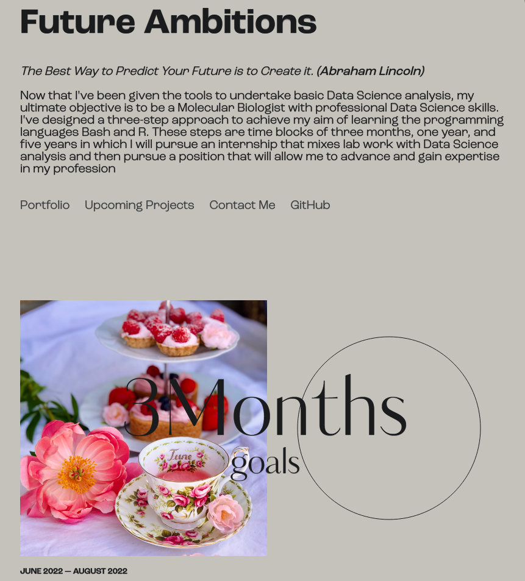

# Learning the Basics of a New Programming Skill in 32 Hours

During my college minor we were provided a 32 hour window in which we were encouraged to learn a new language, or programming skill.

To improve on my portfolio aesthetics I decided to learn how to use HTML and CSS. Spread over the period of a week, I searched for tutorials on Youtube, GitHub and CodePen and made another portfolio. While HTML and CSS don't necessarily provide me with skills to become a better Data Scientist, it had helped me work on the details of R Markdown files, R Shiny apps and any other way in which I can improve the look of a product.

The portfolio may be found [here](https://cherjuliette.github.io/cherjuliette-cherinjuliette.io/) and has page redirects to my 5 year plan to become a Data Scientist, all upcoming projects I plan to do and even a way for prospect employers to contact me! 

# Sources used
+ [Mary Lou (crnacura)](https://github.com/crnacura) for the whooshing cursor effect
+ [CodePen: Video Header Using HTML and CSS](https://codepen.io/kwamz/pen/YzPVEWx)
+ [Tympanus: Preview to Full Content Page](https://tympanus.net/codrops/2021/04/07/preview-to-full-content-page-transition/)