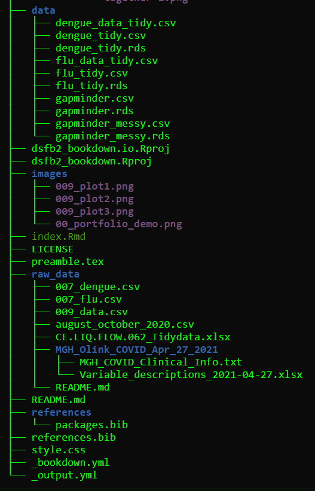

# Data & File Management using the Guerilla Method

File management on a laptop isn't very different from paper file organization.
The most efficient way to structure file organization is to make a Docs, or Document folder which contains a folder for each project.
<br>
The project folder should contain:

  <li>Folder named data
      <p>Which contain all raw data for the project.</p>
  <li>Folder named images</li>
  <li>A file containing all references</li>
  <li>All files that contain the analysis/code</li>
  <li>A README file</li>

## Example
```{r examples, warning=FALSE, message=FALSE}
if (!require(tidyverse)) install.packages("tidyverse")
if (!require(magrittr)) install.packages("magrittr")
if (!require(fs)) install.packages("fs")
```

```{r dir, message=FALSE, warning=FALSE}
## show folder structure of the bookdown project
fs::dir_tree(here::here())
```

