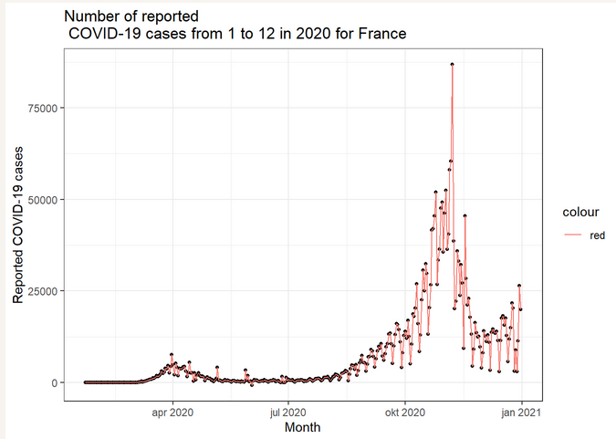
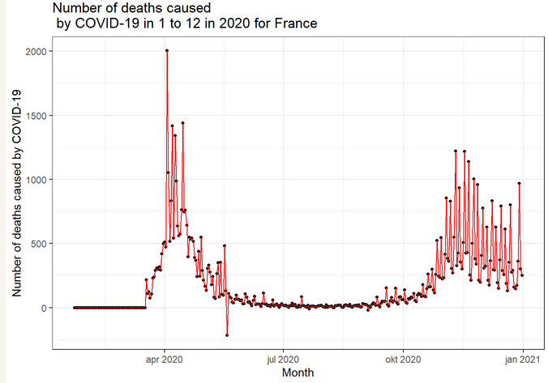
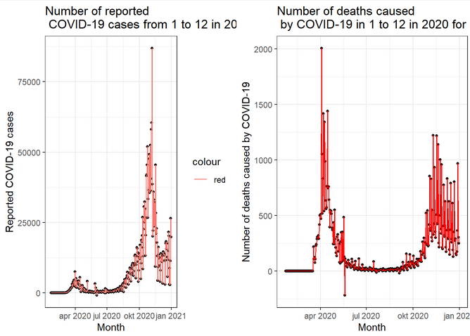

# Evaluating COVID-19 cases and deaths

**Introduction**
Previously, I reproduced the analysis by [Riffomonas](https://github.com/riffomonas/vaccination_attitudes) to demonstrate the value of reproducible research as well as grade the analysis on reproducibility. While the analysis got an A on reproducibility, it also showed that France showed the highest reluctance to get a COVID-19 vaccine in August 2020.

From [the ECDC website](https://www.ecdc.europa.eu/en/publications-data/data-daily-new-cases-covid-19-eueea-country) I downloaded a dataset which contains the number of COVID-19 cases and deaths from 2020 till 2022.

In this analysis I use parameters to plot the number of COVID-19 cases and deaths by COVID-19 (related complications). 


```{r setup, include=FALSE, message=FALSE, warning=FALSE}
if (!require(tidyverse)) install.packages("tidyverse")
if (!require(ggplot2)) install.packages("ggplot2")     ## data visualization
if (!require(cowplot)) install.packages("cowplot")     ## combining plots
if (!require(dplyr)) install.packages("dplyr")         ## tidy data
if (!require(here)) install.packages("here")          ## handy if you cloned the repo
```


```{r extract, warning=FALSE, error=FALSE}
# data import
## from folder raw_data
df <- read.csv(here::here("raw_data", "009_data.csv"))
```

```{r filter data, eval=FALSE, include=TRUE, warning=FALSE, message=FALSE}
# save the plot in an object to combine it later using cowplot
df <- df %>% 
  
  ## filter all data for France
  dplyr::filter(countriesAndTerritories == params$country, 
                year == params$year, 
                month >= params$period_start, 
                month <= params$period_end) 

# the column dateRep gives the full date of the data collected but
## is of the data class character
## change the class type of dateRep to numeric by classifying it as a date
df$dateRep <- as.Date(df$dateRep, format = "%d/%m/%Y")
```

```{r cases plot, eval=FALSE, include=TRUE, warning=FALSE, message=FALSE}
# plot the number of reported COVID-19 cases in the year 2020
cases <- df %>%
  ggplot(aes(x = dateRep, y = cases)) +
  
  ## size of the points
  geom_point(size = 1) +
  
  ## line color
  geom_line(aes(color = "red")) +
  
  ## explain the graph
  labs(title = paste("Number of reported \n COVID-19 cases from", params$period_start, "to", params$period_end, "in", params$year, "for", params$country),
       x = "Month",
       y = "Reported COVID-19 cases") +
  
  ## legend is unnecessary
  theme(legend.position = none) +
  
  ## choose a theme to your liking
  theme_bw()

## let's take a look
cases
```



```{r deaths, message=FALSE, warning=FALSE, eval=FALSE, include=TRUE}
# plot the number of deaths by COVID-19 in the year 2020
deaths <- df %>%
  ggplot(aes(x = dateRep, y = deaths)) +
  
  ## size of the points
  geom_point(size = 1) +
  
  ## color of the lines
  geom_line(color = "red") +
  
  ## explain the graph
  labs(title = paste("Number of deaths caused \n by COVID-19 in", params$period_start, "to", params$period_end, "in", params$year, "for", params$country),
       x = "Month",
       y = "Number of deaths caused by COVID-19") +
  theme(legend.position = none)+
  
  ## choose a theme to your liking
  theme_bw()

## let's take another look
deaths
```



**Combine both plots to visualize the distinction.**
```{r combine, eval=FALSE, include=TRUE, warning=FALSE, message=FALSE}
plot_grid(cases, deaths,
          label_size = 8)
```



**What to take a look under the hood?** [See the source code here](https://github.com/cherjuliette/dsfb2_006_parameters)